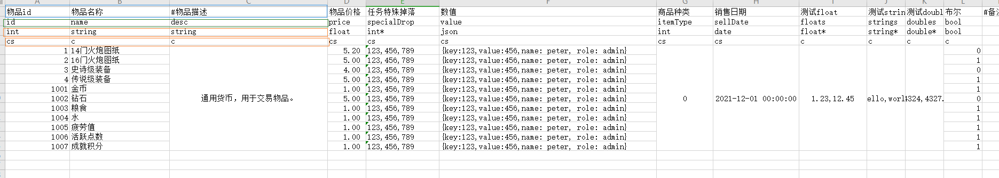
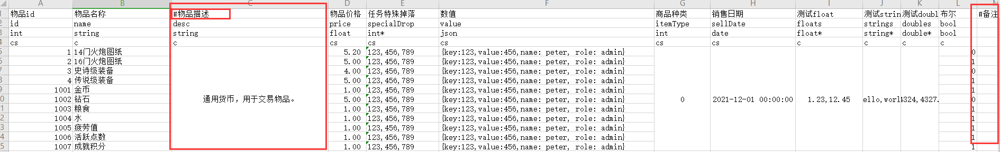
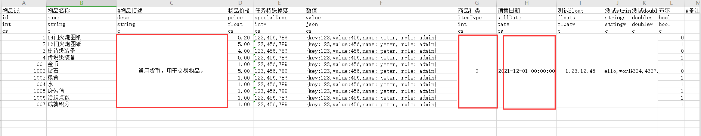
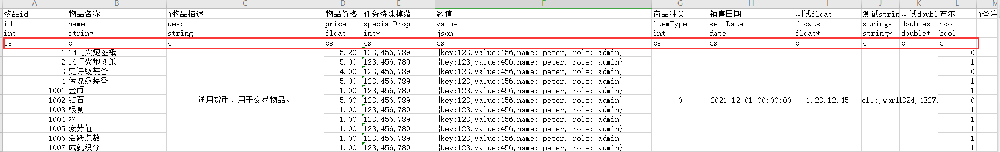
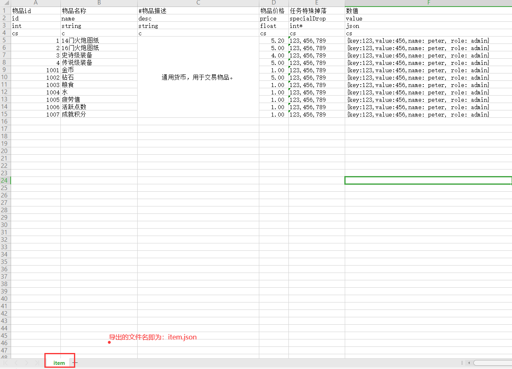

# Excel2Json

### 概述

[Excel2Json](https://github.com/veione/Excel2Json) 是将Excel表格直接导出成JSON文件格式的一个小工具

### 使用方法


1. 配置好conf.json文件;
```json
{
  "input": "C:\\Users\\admin\\IdeaProjects\\Excel2Json\\src\\main\\resources\\excel",
  "format": true,
  "output": {
    "client": "D:\\output\\client\\",
    "server": "D:\\output\\server\\"
  }
}
```
<pre>
input：指定Excel文件的所在目录;
format：是否格式化Json;
output: {
    client：客户端输出的目录位置
    server：服务端输出的目录位置
}
</pre>
2. 运行Run.bat文件  


### 如何使用
<pre>
第一行：字段描述信息
第二行：字段的名称
第三行：字段的类型
第四行：服务端/客户端导出
第五行：开始到结束为数据行
</pre>



#### 字段类型
<pre>
目前的字段类型支持以下格式：
int：整型
string：字符串
float：浮点型
double：双精度浮点型
bool：布尔类型(true/false)
date：日期类型，本质上是一个字符串
int*：整型数组
float*：浮点型数组
double*：双精度浮点型数组
string*：字符串数组
json：通过key:value映射的一个对象
</pre>


#### #号

以`#`开头表示的字段在描述上面表示不会导出该字段。




#### 相同数据合并功能



如果有列的值都是相同的情况下，可以使用单元格合并的方式进行合并为一列，解析的时候会自动解析出合并单元格的内容。

#### 服务器/客户端导出



该行标记了是否是导出到客户端/服务器的文件，如果为空则表示客户端/服务器都会导出，比如某些字段只有客户端会用到那么这里只需要填写c就可以了，如果有些字段只有服务器会用到这里填写s即可，不填写或者填写cs表示客户端和服务器都会进行导出。

#### 关于文件名的说明



导出的文件名是以Excel文件的Sheet为导出文件名的，所以这里一般需要我们在配置表的时候注意尽量不要使用中文或者空格等非法格式。
